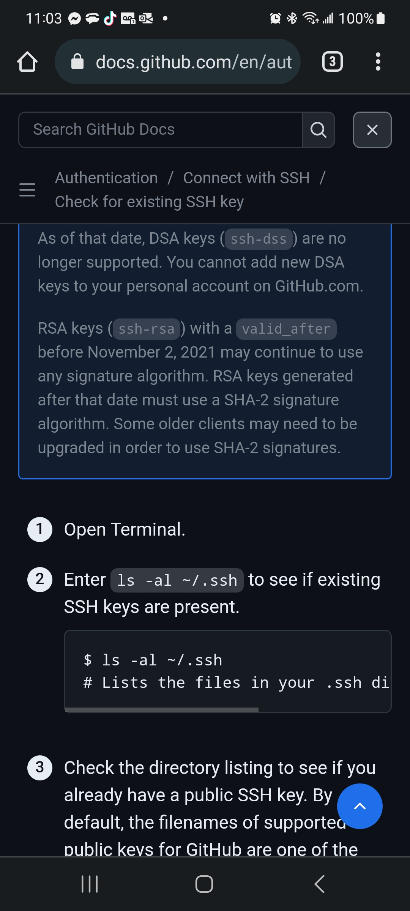

Authentication.. (Link)

 you generate a new SSH key, you should check your local machine for existing keys.

Note: GitHub improved security by dropping older, insecure key types on March 15, 2022.

As of that date, DSA keys (ssh-dss) are no longer supported. You cannot add new DSA keys to your personal account on GitHub.com.

RSA keys (ssh-rsa) with a valid_after before November 2, 2021 may continue to use any signature algorithm. RSA keys generated after that date must use a SHA-2 signature algorithm. Some older clients may need to be upgraded in order to use SHA-2 signatures.

Open Terminal.

Enter ls -al ~/.ssh to see if existing SSH keys are present.

$ ls -al ~/.ssh
# Lists the files in your .ssh directory, if they exist
Check the directory listing to see if you already have a public SSH key. By default, the filenames of supported public keys for GitHub are one of the following.

id_rsa.pub
id_ecdsa.pub
id_ed25519.pub
Tip: If you receive an error that ~/.ssh
